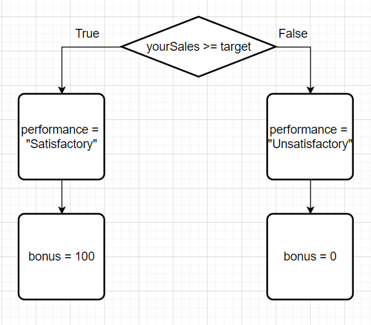
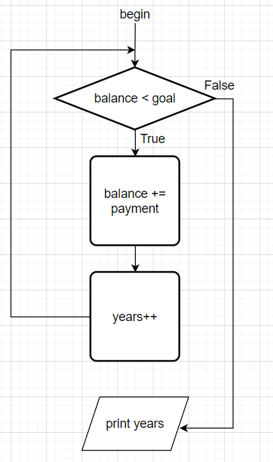
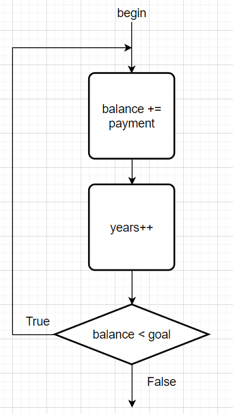
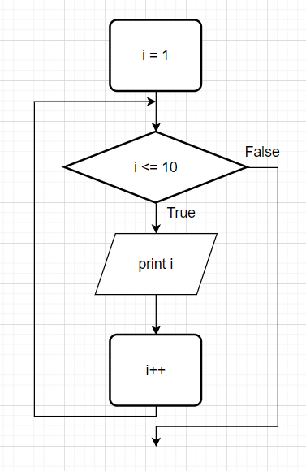

# 3. 控制流程

跟任何的程序设计语言一样，Java使用条件语句和循环结构确定控制流程。

条件语句

* if...else

Java中有三种主要的循环结构：

- **while** 循环
- **do…while** 循环
- **for** 循环

选择语句

* switch case 

## 3.1 块作用域

​	**块**是指由一对大括号括起来的若干条简单的Java语句，块确定了变量的作用域。一个块可以*嵌套*在另一个块中。

> 常见例子：
>
> ```java
> public static void main(String[] args)
> {
>     int n;
>     ...
>     {
>         int k;
>         ...
>     }
> }
> ```

​	但是不能在嵌套的两个块中声明同名的变量。

> ```java
> public static void main(String[] args)
> {
>     int n;
>     ...
>     {
>         int k;
>         int n;//无法通过编译
>         ...
>     }
> }
> ```


## 3.2 条件语句

在JAVA中，条件语句的格式：`if (condition) statement` 在这里的条件必须用括号括起来。

> 例子：
>
> ```java
> if(yourSales >= target)
> {
>     performance = "Satisfactory";
>     bonus = 100;
> }
> ```
>
> 如果变量yourSales大于等于变量target时，就执行语句块类的内容。


还有一种条件语句的格式：`if (condition) statement1 else statement2`。

> 例子：
>
> ```java
> if(yourSales >= target)
> {
>     performance = "Satisfactory";
>     bonus = 100;
> }else{
>     performance = "Unsatisfactory";
>     bonus = 0;
> }
> ```
>
> 


其中else部分是可选的，else子句与最近邻的if构成一组，通常都会使用一对花括号将这段代码变得更加清晰。

> ```java
> if(x <= 0){
>     if(x ==0 ){
>         sign = 0;
>     }else{
>         sign = -1;
>     }
> }
> ```
>
> 当变量x小于等于0时，执行第一层括号内的内容。当变量x等于0时候，sign等于0，否则sign等于-1。


if语句通常还会使用多个。

> ```java
> if(yourSale >= 2*target){
>     performance = "Excellent";
>     bonus = 1000;
> }else if(yourSale >= 1.5*target){
>     performance = "Fine";
>     bonus = 500;
> }else if(yourSale >= target){
>     performance = "Satisfactory";
>     bonus = 100;
> }else{
>     System.out.println("You're fired");
> }
> ```
>
> - 如果变量yourSale大于等于2倍的变量target，performance的值就为“Excellent”，bonus的值就等于1000；
>
> - 否则如果变量yourSale大于等于1.5倍的变量target，performance的值就为“Fine”，bonus的值就等于500；
>
> - 否则如果变量yourSale大于等于变量target，performance的值就为“Satisfactory”，bonus的值就等于100；
>
> - 若上述条件都不满足，则输出“You're fired"。


## 3.3 循环

​	当条件为true时，while循环执行一条语句（或语句块）。语法格式为：`while (condition) statement`。若开始循环条件的值为false，则while循环体一次也不执行。

> ```java
> while(balance < goal){
>     balance += payment;
>     years++;
> }
> System.out.println(years + "years.");
> ```
>
> 


​	如果希望循环体至少执行一次，则应该将被检测条件放在最后。用do-while循环语句可以实现这一操作。语法格式为：`do statement while (condition)`。

> 还是上面的例子：
>
> ```java
> do{
> 	balance += payment;
>     years++;
> }while(balance < goal)
> ```
>
> 


## 3.4 确定循环

​	for循环语句是支持迭代的一种通用结构，利用每次迭代之后更新的计数器或类似的变量来控制迭代次数。

> 例子，将数字1~10输出到屏幕上：
>
> ```java
> for (int i = 1; i <= 10; i++){
>     System.out.println(i);
> }
> ```
>
> 

​	for语句的第一部分通常用于对计数器初始化，第二部分给出每次新一轮循环执行前要检测的循环条件，第三部分指示如何更新计数器。

​	当for语句的第一部分声明了一个变量后，这个变量的作用域就为for循环的整个循环体，不能在循环体外使用。

```java
for (int i = 1; i <= 10; i++){
    ....//i只能作用域这块作用域
}
```

​	如果想要在for循环体外使用循环计数器的最终值，就要确保这个变量在循环体语句前被声明。

```java
int i;
for(i = 1;i <= 10;i++){
    ...
}
//i在for块作用域外也能用
```

​	还可以在各自独立的不同for循环中定义同名的变量：

```java
for (int i = 1; i <= 10; i++){
    ...
}
for (int i = 11; i <= 20; i++){
    ...
}
```

​	for循环语句是while循环的一种简化形式。

```java
int i = 10;
while(i > 0){
    System.out.println("..."+i);
    i--;
}
//等同于
for(int i = 10; i>0; i--){
    System.out.println("..."+i);
}
```


## 3.5 中断控制流程语句

​	break语句用于退出循环。

>```java
>while(years <= 100){
>    balance += payment;
>    if(balance >= goal) break;
>    years++;
>}
>```
>
>​	在循环开始时，若years>100或在循环体中balance >= goal，就退出循环。

​	

​	continue语句中断正常的控制流程，语句将控制转移到最内层循环的首部。

> ```java
> while(sum < goal){
>     n = in.nextInt();
>     if(n < 0) continue;
>     sum += n;
> }
> ```
>
> ​	如果n<0，则continue语句越过了当前循环体的剩余部分，立刻跳到循环首部。

​	如果将continue语句用于for循环中，就可以跳到for循环的“更新”部分。

> ```java
> for(int i=1;i<=100;i++){
>     n = in.nextInt();
>     if(n<0) continue;
>     sum += n;
> }
> ```
>
> ​	如果n<0，则continue语句跳到count++语句。


## 3.6 多重选择：switch语句

​	在处理多个选项时，使用if-else结构会显得有些笨拙，在这里Java也有一个switch语句。

```java
switch(choice)
{
    case 1:
        ...;
        break;
    case 2:
        ...;
        break;
    case 3:
        ...;
        break;
    case 4:
        ...;
        break;
    default:
        ...;
        break;
}
```

​	switch语句将从与选项值相匹配的case标签处开始执行，直到遇到break语句，或执行到switch语句的结束处为止。若没有匹配的case标签，有default子句的话就会执行这个子句。

 	注意：若在case分支语句的末尾没有break语句，那么就会接着执行下一个case分支语句（这时候不看条件是否成立都会执行）。


## 参考资料

[1] 《Java核心技术 卷I 基础知识》  ------【美】凯S. 霍斯特曼