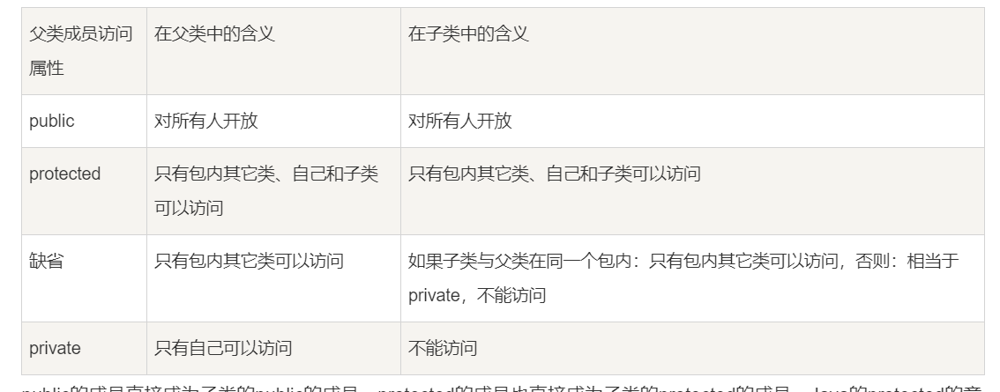

# 6. 继承与多态

## 6.1 什么是继承

继承是面向对象编程中的特征之一，即从已有的类中派生出新的类，新的类具有父类的方法，同时也可以增加新的方法。这种特性使得复用代码非常容易，缩短开发周期。

例如兔子和羊属于食草动物类，狮子和豹属于食肉动物类。食草动物和食肉动物都属于动物类。


在java中使用extends 关键字来声明子类继承于某父类，如下：

```java
class 父类 {
}
 
class 子类 extends 父类 {
}
```

下面用一个例子说明继承

**公共父类**

```java
public class Animal { 
    private String name;  
    private int id; 
    public Animal(String myName) { 
        name = myName; 
    } 
    public void eat(){ 
        System.out.println(name+"正在吃"); 
    }
    public void sleep(){
        System.out.println(name+"正在睡");
    }
    public void introduction() { 
        System.out.println("我是" + name + "."); 
    } 
}
```

**老虎类**

```java
public class tiger extends Animal { 
    public Penguin(String myName) { 
        super(myName); 
    } 
}
```

**兔子类**

```java
public class rabbit extends Animal { 
    public Mouse(String myName) { 
        super(myName); 
    } 
}
```

## 6.2 继承类型

继承又分单继承、多继承和多重继承。

单继承是指一个子类最多只能有一个父类。多继承是一个子类可以有二个以上的父类。多重继承是grandfather-father-son的关系

多重继承例子如下：

```java
public class A{}
public class B extends A{}
public class C extends B{}
```

**Java不支持多继承**


## 6.3 继承关键字

### 6.3.0 extends

### 6.3.1 implements

Java除了extends，还可以用implements关键字来实现继承。Java中不支持多重继承，但是用implements可以实现多个接口，相当于使得Java具有多继承的特性。

```java
public interface if1 {
    public void method1();
}
 
public interface if2 {
    public void method2();
}
 
public class if3 implements if1,if2 {
}
```


### 6.3.2 super与this 

super：引用当前对象的父类成员

this：指向当前类的引用。

```java
class Father {
  void method() {
    System.out.println("这是父类的方法");
  }
}
 
class Son extends Father {
  void method() {
    System.out.println("这是子类的方法");
  }
  void diff_method() {
    this.method();   
    super.method();  
  }
}
 
public class Test {
  public static void main(String[] args) {
    Father father = new Father();
    father.method();
    Son son = new Son();
    son.diff_method();
  }
}
```


### 6.3.3 final

final即最终的，不可变的。

final的功能是将类定义为不可继承的，也可以用于修饰方法，被修饰的方法不可被子类重写。


## 6.4 继承的特性

1. 子类不继承父类的private属性和方法
2. 子类可以对父类进行扩展，拥有自己的属性和方法
3. 子类是不继承父类的构造器（构造方法或者构造函数）的，它只是调用（隐式或显式）。如果父类的构造器带有参数，则必须在子类的构造器中显式地通过super关键字调用父类的构造器并配以适当的参数列表
4. 如果父类构造器没有参数，则在子类的构造器中不需要使用 super 关键字调用父类构造器，系统会自动调用父类的无参构造器。

权限划分：




## 6.5 重写与重载

重写是子类对父类的允许访问的方法的实现过程进行重新编写, 返回值和形参都不能改变。**即外壳不变，核心重写！**重写的好处在于子类可以根据需要，定义特定于自己的行为。 也就是说子类能够根据需要实现父类的方法。

重载(overloading) 是在一个类里面，方法名字相同，而参数不同。返回类型可以相同也可以不同。每个重载的方法（或者构造函数）都必须有一个独一无二的参数类型列表。别u构造器的重载。

> https://www.runoob.com/java/java-override-overload.html

方法的重写(Overriding)和重载(Overloading)是java多态性的不同表现，重写是父类与子类之间多态性的一种表现，重载可以理解成多态的具体表现形式。

- (1)方法重载是一个类中定义了多个方法名相同,而他们的参数的数量不同或数量相同而类型和次序不同,则称为方法的重载(Overloading)。
- (2)方法重写是在子类存在方法与父类的方法的名字相同,而且参数的个数与类型一样,返回值也一样的方法,就称为重写(Overriding)。
- (3)方法重载是一个类的多态性表现,而方法重写是子类与父类的一种多态性表现。

## 6.6 什么是多态

多态是同一个行为具有多个不同表现形式或形态的能力。例如一个人，可以是同时是数学家和物理学家。

## 6.7 多态的转型

多态的转型有向上转型和向下转型两种。


**向上转型**

当不需要面对子类类型时，通过提高扩展性，或者使用父类的功能就能完成相应的操作。

父类类型 变量名=new 子类类型()


**向下转型**

当要使用子类特有功能时。

子类类型 变量名=（子类类型） 父类类型的变量；


示例代码：

```java
public class Test {
    public static void main(String[] args) {
      show(new Cat());  // 以 Cat 对象调用 show 方法
      show(new Dog());  // 以 Dog 对象调用 show 方法
                
      Animal a = new Cat();  // 向上转型  
      a.eat();               // 调用的是 Cat 的 eat
      Cat c = (Cat)a;        // 向下转型  
      c.work();        // 调用的是 Cat 的 work
  }  
            
    public static void show(Animal a)  {
      a.eat();  
        // 类型判断
        if (a instanceof Cat)  {  // 猫做的事情 
            Cat c = (Cat)a;  
            c.work();  
        } else if (a instanceof Dog) { // 狗做的事情 
            Dog c = (Dog)a;  
            c.work();  
        }  
    }  
}
 
abstract class Animal {  
    abstract void eat();  
}  
  
class Cat extends Animal {  
    public void eat() {  
        System.out.println("吃鱼");  
    }  
    public void work() {  
        System.out.println("抓老鼠");  
    }  
}  
  
class Dog extends Animal {  
    public void eat() {  
        System.out.println("吃骨头");  
    }  
    public void work() {  
        System.out.println("看家");  
    }  
}

```

多态存在的三个必要条件

- 继承
- 重写
- 父类引用指向子类对象：**Parent p = new Child();**

多态的实现方式

* 重写

* 接口

- 抽象类和抽象方法