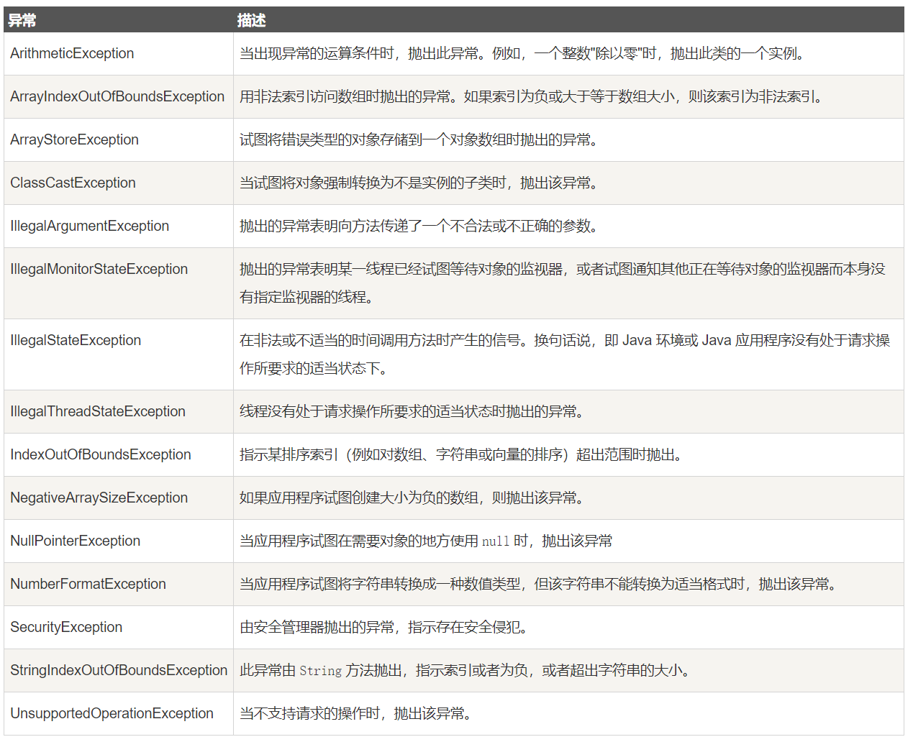
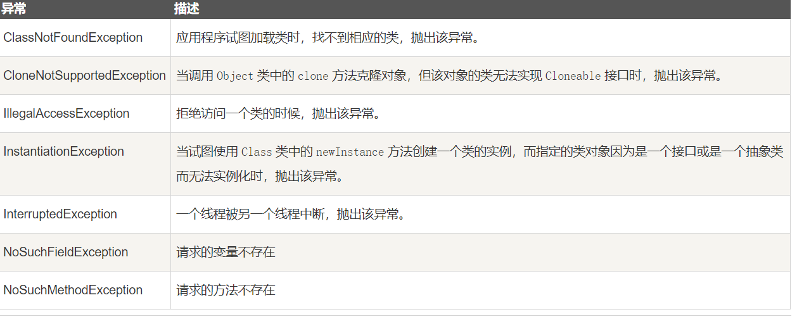

# 8. 异常处理

## 什么是异常？

异常是程序中的一些错误使得程序没有按照预期正常执行。Java提供了异常处理机制处理异常问题。

异常处理机制可以让程序在发生异常时，按照预先设计的逻辑处理异常。

产生异常的原因有很多，通常是：

- 用户输入了非法数据。
- 要打开的文件不存在。
- 网络通信时连接中断，或者JVM内存溢出。

异常的类型有以下三种：

- **检查性异常：**最具代表的检查性异常是用户错误或问题引起的异常，这是程序员无法预见的。例如要打开一个不存在文件时，一个异常就发生了，这些异常在编译时不能被简单地忽略。（编译器检查）
- **运行时异常：** 运行时异常是可能被程序员避免的异常。与检查性异常相反，运行时异常可以在编译时被忽略。
- **错误：** 错误不是异常，而是脱离程序员控制的问题。错误在代码中通常被忽略。例如，当栈溢出时，一个错误就发生了，它们在编译也检查不到的。


## 异常的分类

异常处理的根接口是Throwable，有两个子接口，分别是Error和Exception。

Error：用来指示运行时环境发生的错误，这是系统错误类，一般开发人员无法处理，只能关闭程序。

Exception：指的是程序运行中产生的异常。


Exception下的异常分为两大类，分别是Runtime异常和非Runtime异常

Runtime异常：程序运行时产生的异常，jvm会自动处理。典型的运行时异常有：数组下标越界异常（IndexOutOfBoundsException）、空指针异常（NullPointerException）、对象类型强制转换异常（ClassCastException）以及数组存储异常（ArrayStoreException，即数组存储类型不一致）等。

非Runtime异常：也叫检查异常，即编译器要求必须进行处理的异常，例如IOException、SqlException。

**非检查异常/运行时异常**



**检查性异常/非运行异常**



## 异常处理流程

Java异常机制用到的几个关键字：try、catch、finally、throw、throws。

**try**: 用于监听。将要被监听的代码(可能抛出异常的代码)放在try语句块之内，当try语句块内发生异常时，异常就被抛出。
**catch**：用于捕获异常。catch用来捕获try语句块中发生的异常。
**finally**：finally语句块总是会被执行。它主要用于回收在try块里打开的物力资源(如数据库连接、网络连接和磁盘文件)。只有finally块，执行完成之后，才会回来执行try或者catch块中的return或者throw语句，如果finally中使用了return或者throw等终止方法的语句，则就不会跳回执行，直接停止。
**throw**：用于抛出异常。
**throws**：用在方法签名中，用于声明该方法可能抛出的异常。主方法上也可以使用throws抛出。如果在主方法上使用了throws抛出，就表示在主方法里面可以不用强制性进行异常处理，如果出现了异常，就交给JVM进行默认处理，则此时会导致程序中断执行。
产生异常的原因：


## try-catch

```java
try
{
   // 程序代码
}catch(ExceptionName e1)
{
   //Catch 块
}
```


## try-catch-finally

finally 关键字用来创建在 try 代码块后面执行的代码块。

无论是否发生异常，finally 代码块中的代码总会被执行。

在 finally 代码块中，可以运行清理类型等收尾善后性质的语句。

finally 代码块出现在 catch 代码块最后，语法如下：

```java

try{
  // 程序代码
}catch(异常类型1 异常的变量名1){
  // 程序代码
}catch(异常类型2 异常的变量名2){
  // 程序代码
}finally{
  // 程序代码
}
```

（多重捕获块）

## throws/throw

如果一个方法没有捕获到一个检查性异常，那么该方法必须使用 throws 关键字来声明。throws 关键字放在方法签名的尾部。

也可以使用 throw 关键字抛出一个异常，无论它是新实例化的还是刚捕获到的。

下面方法的声明抛出一个 RemoteException 异常：

```java
import java.io.*; 
public class className {  
    public void deposit(double amount) throws RemoteException  
		{    // Method implementation    throw new RemoteException();  }  //Remainder of class definition }
```

一个方法可以声明抛出多个异常，多个异常之间用逗号隔开。

例如，下面的方法声明抛出 RemoteException 和 InsufficientFundsException：

```java
import java.io.*; 
public class className {   public void withdraw(double amount) throws RemoteException,                              InsufficientFundsException   {       // Method implementation   }   //Remainder of class definition }


```

* throws 用在函数上，声明该函数的功能可能会出现问题。将异常抛出，是问题暴露出来，用于处理。可以抛给虚拟机处理，或者使用 try....catch... 进行处理。虚拟机的处理方式，就是将异常打印出来，并且将在异常处的代码终止。
* throw 用在代码块中，后面跟着异常的对象，该对象可以是自定义异常，且 throw 使用在方法中

## 自定义异常

在 Java 中你可以自定义异常。编写自己的异常类时需要记住下面的几点。

- 所有异常都必须是 Throwable 的子类。
- 如果希望写一个检查性异常类，则需要继承 Exception 类。
- 如果你想写一个运行时异常 的异常类是检查性异常类。


```java
class WrongInputException extends Exception {  // 自定义的类
    WrongInputException(String s) {
        super(s);
    }
}
class Input {
    void method() throws WrongInputException {
        throw new WrongInputException("Wrong input"); // 抛出自定义的类
    }
}
class TestInput {
    public static void main(String[] args){
        try {
            new Input().method();
        }
        catch(WrongInputException wie) {
            System.out.println(wie.getMessage());
        }
    } 
}
```


## 异常使用规则

* 在当前方法被覆盖时，覆盖他的方法必须抛出相同的异常或异常的子类；
* 在当前方法声明中使用try-catch语句捕获异常；
* 如果父类抛出多个异常，则覆盖方法必须抛出那些异常的一个子集，不能抛出新异常。
* 对于异常的捕获不应该觉得方便而将几个异常合成一个Exception进行捕获

